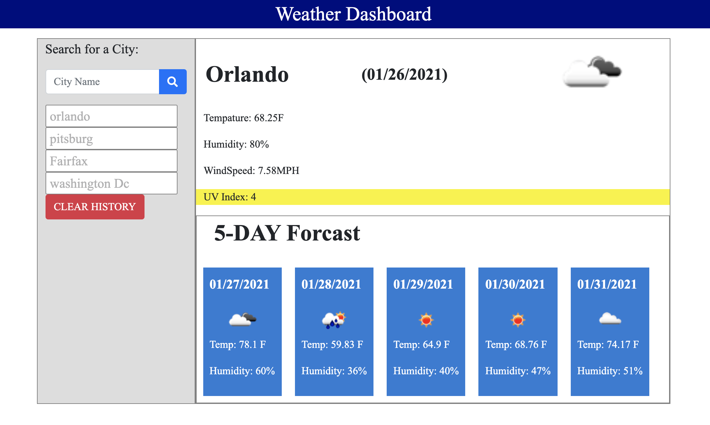

# Summary:
A weather dashboard with a list of all previously searched city. Once the page is open the last searched city will appear.
* Broken down into Two sections A daily forcast for the area and a area for a five day forcast:

    * The daily forcast consit of Tempature in FarienHeight, Humidity, WindSpeed, and UV index
        * UV index ranges from Extreme to Low: 
            * (Extrem = purple){Range UV INDEX ABOVE 11}
            * (Extrem = red){Range UV INDEX between 8 to 11}
            * (Extrem = orange){Range UV INDEX between 7 to 6}
            * (Extrem = yellow){Range UV INDEX between 3 to 5}
            * (low = green){Range UV INDEX below 3}

     * The five day includes the date , tempature ,humidity and icon.

# Usage:
User will add text to time slots and save

# Future Improvements:
Once the month changes the date needs to be fixed so it works correctly in between the end of the month and current 

# Installation:
  There is no installation required for this page, all files can be viewed at the following link:
* Git Repository: https://github.com/Jacqueline8996/WeatherDash.git
* Git Hub Page : https://jacqueline8996.github.io/WeatherDash/

# IMage of deployed app in use:

